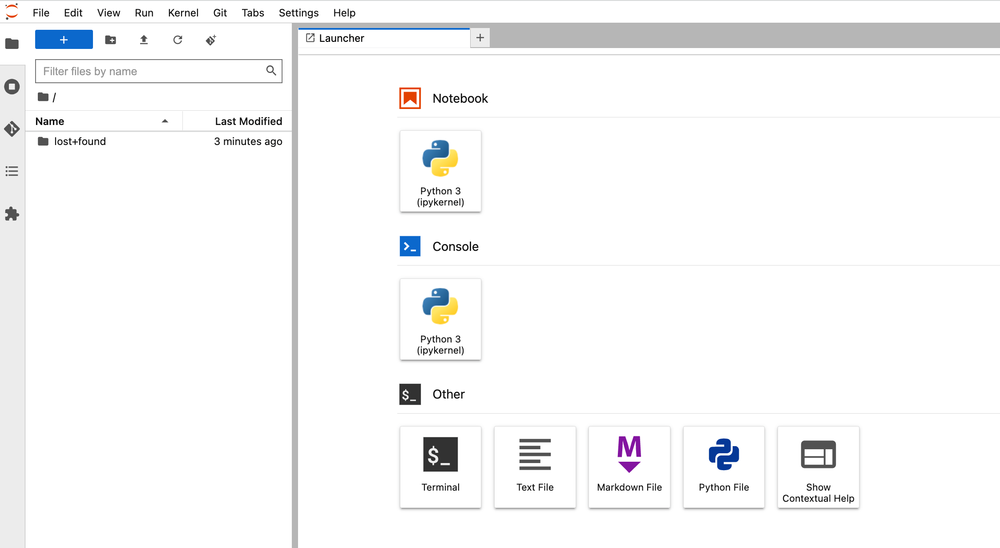

## Use Cases

1. Once you are logged into the Kubeflow dashboard, ensure you have the right namespace "kubeflow-user-example-com" on top of the drop down

 
  

2. Create Jupyter Notebook

2.1 Click on “Notebooks” on left navigation of the Kubeflow dashboard. Click on “New Notebook” button. Enter name as “aws-nb”, select “jupyter-pytorch:1.12.0-cpu-py38-ubuntu20.04-ec2-2022-09-20” as Jupyter Docker Image. Enter 1 for CPU and 5 as memory in Gi. Keep GPUs as None.

 
  

2.2 Do not change "Workspace Volume" and "Data Volumes" section. 

2.3 Select value "Allow access to Kubeflow Pipelines" in Configurations section and click LAUNCH . 

 
  

2.4 Verify if notebook is created successfully and CONNECT button is activated. It might takes couple of minutes to create a notebook.

 
  

2.5 Click on CONNECT button to log on to JupyterLab shown below. 

 
  

2.6 Clone the repo by entering `https://github.com/aws-samples/aws-deeplearning-labs.git` in "Clone a repo" field

 
  

 
  

2.6 Browse to "aws-deeplearning-labs/workshop/pytorch-distributed-training" folder

2.7 Run notebook “STEP1.0_create_pipeline_k8s_sagemaker.ipynb" to create a pipeline that runs and deploy models on Amazon SageMaker

2.8 Run notebook “STEP1.1_invoke_sagemaker_endpoint.ipynb” to invoke and test SageMaker model inference endpoint created in previous notebook

2.9 Run notebook “STEP2_simple_xgboost_training_pipeline.ipynb” to run simple XGBoost training pipline
